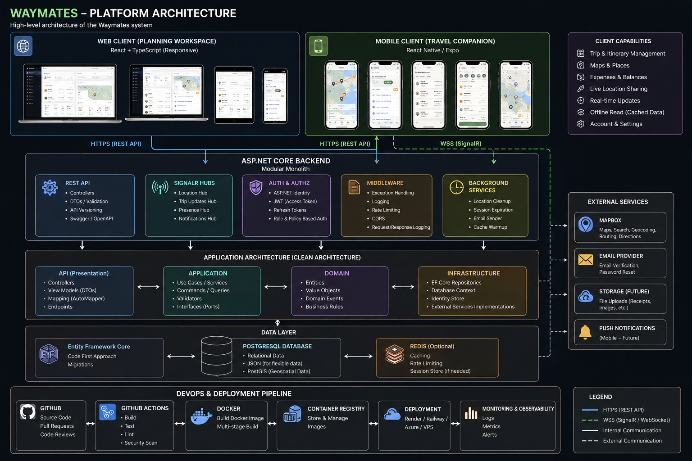
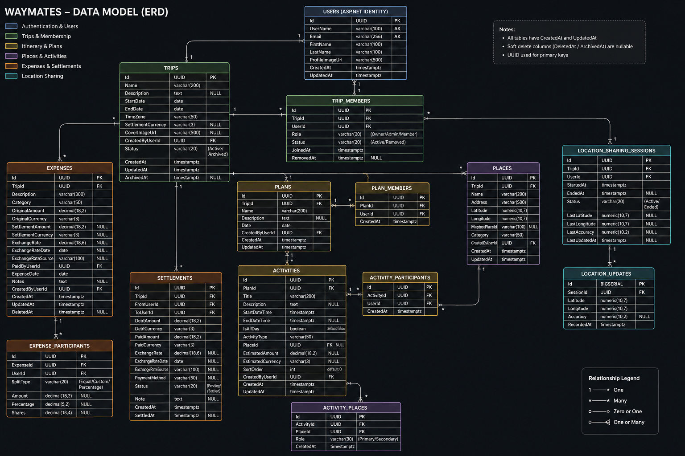

# Waymates

### Plan together. Explore together. Settle up together.

Waymates is a collaborative travel planning application designed for friends traveling together.

It brings trip planning, interactive maps, group expenses, settlements, and optional location sharing into one place.

> 🚧 **Status: In Development**

---

## ✈️ What is Waymates?

Planning a trip with friends usually means jumping between several apps:

- One app for the itinerary
- Another for maps
- A spreadsheet for expenses
- A group chat for plans
- Another app for location sharing

Waymates aims to bring those experiences together.

The application is designed around two complementary experiences:

### 🖥️ Web — Planning Workspace

Designed primarily for planning and managing a trip:

- Collaborative trip planning
- Multiple itineraries and group plans
- Saved places and map-based planning
- Detailed expense management
- Multi-currency expense splitting
- Balances and settlements
- Trip member management
- Live location viewing

### 📱 Mobile — Travel Companion

Designed for use while traveling:

- Today's itinerary
- Interactive maps
- Directions
- Quick expense entry
- Expense and balance checking
- Live location sharing
- Finding travel companions

Both clients share the same backend and data.

---

## ✨ Planned Features

### 🧳 Trip Management

- Create and manage trips
- Invite friends
- Trip member roles
- Trip settings
- Configurable settlement currency

### 🗓️ Itinerary Planning

- Day-by-day itinerary
- Multiple plans/groups on the same day
- Different activities for different groups
- Activity participants
- Saved places linked to activities

### 🗺️ Maps & Places

- Interactive maps
- Search for places
- Save places
- Pin places to trips
- Route visualization
- Walking/driving/cycling directions
- Open routes in Google Maps or Apple Maps

### 💰 Expenses & Settlements

- Record group expenses
- Multiple currencies
- Preserve original expense currency
- Configurable settlement currency
- Equal/custom/percentage splitting
- Automatic balance calculation
- Suggested settlements
- Record actual settlements
- Support settlements made in a different currency
- Exchange-rate tracking

### 📍 Location Sharing

Location sharing is intentionally **session-based** rather than automatically expiring at midnight.

Members can:

- Start sharing their location
- Stop sharing at any time
- View friends who are currently sharing
- See location status
- Handle offline/unavailable locations

Location sharing is only available to appropriate members of the same trip while sharing is active.

### ⚡ Realtime

SignalR will provide realtime updates for:

- Location sharing
- Trip updates
- Itinerary changes
- Expense updates
- Member changes

### 📶 Offline

The initial release will provide basic cached/read-only access to important trip data.

Full offline mutation and synchronization is planned for a later phase.

---

## 🏗️ Architecture

Waymates uses a **modular monolith** architecture.

The goal is to keep the system simple to develop and deploy while maintaining clear boundaries between business capabilities.

```text
                    WAYMATES
                       |
          +------------+------------+
          |                         |
     React Web              React Native / Expo
          |                         |
          +------------+------------+
                       |
                ASP.NET Core API
                       |
          +------------+------------+
          |            |            |
        REST        SignalR       Auth
          |            |            |
          +------------+------------+
                       |
                    EF Core
                       |
                  PostgreSQL
```

### Why a Modular Monolith?

Waymates is initially a relatively small application developed by a small team.

A microservices architecture would introduce additional operational complexity such as:

- Multiple independently deployed services
- Inter-service communication
- Distributed authentication
- Service discovery
- Message brokers
- Distributed tracing
- Multiple deployment pipelines
- More complicated local development

Instead, Waymates keeps the backend as one deployable application while maintaining clear module boundaries.

```text
ASP.NET Core
│
├── Authentication
├── Trips
├── Members
├── Plans
├── Places
├── Expenses
├── Settlements
└── Locations
```

This also leaves the option to extract individual modules into services later if the product grows enough to justify it.

> **Principle:** Start simple, keep boundaries clear, and add complexity only when the product actually needs it.

---

## 🛠️ Tech Stack

### Web

- React
- TypeScript
- Vite
- React Router
- TanStack Query
- Mapbox GL JS

### Mobile

- React Native
- Expo
- TypeScript

### Backend

- ASP.NET Core
- ASP.NET Core Identity
- JWT
- SignalR
- Entity Framework Core

### Database

- PostgreSQL

### Infrastructure & DevOps

- Docker
- GitHub Actions
- CI/CD
- Managed cloud hosting
- Managed PostgreSQL

### External Services

- Mapbox
- Email provider
- Future object/file storage
- Optional error monitoring

---

## 🗺️ Architecture Diagrams

### Platform Architecture



### Data Model / ERD



For the complete architecture specification:

[📘 View the Waymates Architecture Blueprint](./docs/architecture/Waymates_Architecture_Blueprint_v1.0.md)

---

## 📱 Responsive Design

Waymates has three UI targets:

| Platform | Primary Purpose |
|---|---|
| 🖥️ Desktop Web | Trip planning and management |
| 📱 Responsive Web | Quick access from phones/tablets |
| 📱 Native Mobile | Travel companion and device capabilities |

The responsive web application will adapt its layout rather than simply shrinking the desktop interface.

The native mobile application will handle capabilities that require deeper device integration, particularly location sharing.

---

## 🔐 Security

Waymates uses:

- ASP.NET Identity
- JWT access tokens
- Refresh tokens
- Role and policy-based authorization
- Trip-level authorization
- Environment-based secrets
- Input validation
- Protected location access

Location data is treated as sensitive trip information.

A user's location is only available to appropriate members of the same trip while location sharing is active.

---

## 🚀 CI/CD & Deployment

The planned deployment pipeline is:

```text
Feature Branch
      |
      v
Pull Request
      |
      v
GitHub Actions
      |
      +-- Build
      +-- Test
      +-- Lint
      +-- Security Checks
      |
      v
Merge to main
      |
      v
Docker Build
      |
      v
Container Registry
      |
      v
Deployment
```

Planned environments:

```text
Development
     ↓
Staging
     ↓
Production
```

The initial hosting approach is planned around:

- Vercel for the web frontend
- Render or Railway for the ASP.NET Core backend
- Managed PostgreSQL
- Docker for backend packaging

Azure may be explored later as an additional cloud deployment exercise.

---

## 🧪 Testing Strategy

The project will include:

### Unit Tests

Focused on business rules such as:

- Expense splitting
- Currency conversion
- Balance calculation
- Settlement optimization
- Membership rules
- Authorization rules

### Integration Tests

Testing workflows such as:

- Creating trips
- Joining trips
- Adding members
- Creating expenses
- Calculating balances
- Recording settlements

### Frontend Tests

Testing important user journeys:

- Login
- Creating a trip
- Adding an activity
- Adding an expense
- Viewing balances

---

## 🗺️ Roadmap

### Phase 1 — Foundation

- [x] Product design
- [x] UX design
- [x] Architecture design
- [x] ERD
- [x] CI/CD strategy
- [X] Repository setup
- [X] React project
- [X] ASP.NET Core solution
- [X] PostgreSQL
- [X] Docker
- [X] Initial GitHub Actions pipeline
- [ ] First deployment

### Phase 2 — Authentication

- [ ] ASP.NET Identity
- [ ] Registration
- [ ] Login
- [ ] JWT
- [ ] Refresh tokens
- [ ] Email verification
- [ ] Password reset

### Phase 3 — Trips & Members

- [ ] Create trip
- [ ] Join trip
- [ ] Invite members
- [ ] Member roles
- [ ] Trip ownership
- [ ] Trip settings

### Phase 4 — Itinerary

- [ ] Plans
- [ ] Multiple group plans
- [ ] Activities
- [ ] Activity participants
- [ ] Places

### Phase 5 — Maps

- [ ] Mapbox integration
- [ ] Place search
- [ ] Saved places
- [ ] Map pins
- [ ] Route visualization
- [ ] Directions

### Phase 6 — Expenses

- [ ] Expense recording
- [ ] Multi-currency
- [ ] Equal splitting
- [ ] Custom splitting
- [ ] Percentage splitting
- [ ] Balance calculation
- [ ] Settlement suggestions

### Phase 7 — Settlements

- [ ] Record settlements
- [ ] Different settlement currency
- [ ] Exchange-rate tracking
- [ ] Settlement history

### Phase 8 — Realtime

- [ ] SignalR
- [ ] Realtime trip updates
- [ ] Location-sharing sessions
- [ ] Live locations
- [ ] Location status handling

### Phase 9 — Offline

- [ ] Local caching
- [ ] Offline state
- [ ] Last-synced trip data

### Phase 10 — Production Polish

- [ ] Automated tests
- [ ] Security hardening
- [ ] Monitoring
- [ ] Performance improvements
- [ ] Production deployment
- [ ] Portfolio documentation

---

## 📁 Repository Structure

The planned repository structure is:

```text
waymates/
│
├── README.md
├── LICENSE
├── .gitignore
│
├── docs/
│   ├── architecture/
│   │   └── Waymates_Architecture_Blueprint_v1.0.md
│   │
│   └── diagrams/
│       ├── waymates-platform-architecture.png
│       └── waymates-data-model-erd.png
│
├── backend/
│   ├── Waymates.Api/
│   ├── Waymates.Application/
│   ├── Waymates.Domain/
│   ├── Waymates.Infrastructure/
│   └── tests/
│
├── frontend/
│   └── waymates-web/
│
└── .github/
    └── workflows/
```

---

## 🎯 Project Goals

Waymates is being developed as both:

1. A real-world travel companion for an upcoming trip.
2. A portfolio project demonstrating modern full-stack development.

The project is intended to demonstrate practical experience with:

- Modern .NET development
- React and TypeScript
- REST API design
- Realtime communication
- PostgreSQL
- Entity Framework Core
- Geospatial applications
- Multi-currency business logic
- Authentication and authorization
- Responsive UI/UX
- Docker
- CI/CD
- Cloud deployment
- Testing and production practices

---

## 📌 Project Status

**🚧 In Development**

The product design, UX direction, architecture, and initial data model have been established.

Implementation is now beginning with the project foundation.

---

## 📄 License

License to be determined.
